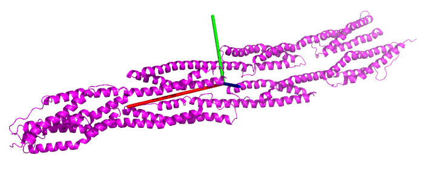

# Principal axes

This program reads a .pdb file, computes principal axes and produces a .pml PyMoL script to view axes.

Note that only C-alpha atoms are read and that the .pdb file must only contain a single *coherent* protein structure.


## Example

with the cryo-EM structure of chicken gizzard smooth muscle alpha-actinin ([1SJJ](http://www.rcsb.org/pdb/explore.do?structureId=1SJJ) from the [Protein Data Bank](http://www.rcsb.org/pdb/home/home.do)):

```bash
python3 principal_axes.py  1SJJ.pdb
```

```bash
950 CA atomes found in 1SJJ.pdb
Coordinates of the geometric center:
 [-107.35616421  -44.75738526    8.11289053]
(Unordered) eigen values:
[ 4854301.51173111   111627.33781935    52235.74662753]
(Unordered) eigen vectors:
[[ 0.85667497  0.50720869  0.09406029]
 [ 0.51289152 -0.81795036 -0.26057532]
 [ 0.05522942 -0.27147108  0.96086064]]
Inertia axis are now ordered !

First principal axis (in red)
coordinates:  [ 0.85667497  0.51289152  0.05522942]
eigen value:  4854301.51173

Second principal axis (in green)
coordinates: [ 0.50720869 -0.81795036 -0.27147108]
eigen value: 111627.337819

Third principal axis (in blue)
coordinates: [ 0.09406029 -0.26057532  0.96086064]
eigen value: 52235.7466275

You can view principal axes with PyMOL:
pymol 1SJJ_axes.pml 1SJJ.pdb

```



## History

2017: thanks to @StevenCHowell, the code is not Python 3 ready.

2013: The first version of this script had been posted in the Biostar forum as an answer to [Question: Protein 3D structure principal axes](http://www.biostars.org/p/7393/)
